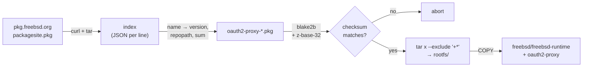

# oauth2-proxy for FreeBSD, as an OCI image

[oauth2-proxy](https://github.com/oauth2-proxy/oauth2-proxy) built from the
FreeBSD `www/oauth2-proxy` package, on top of `freebsd/freebsd-runtime`, so it
can run in a FreeBSD jail under `podman` without pulling in a Linux userland.

```sh
podman pull ghcr.io/gabrielbelli/oauth2-proxy-freebsd:latest
```

Multi-architecture: `freebsd/amd64` and `freebsd/arm64`.

## Why

The FreeBSD project began publishing OCI-compatible container images in 14.2
(*"The FreeBSD project is now publishing OCI-compatible container images"* —
14.2 release notes; the `freebsd/freebsd-runtime` tag list starts there too).
The upstream oauth2-proxy images are Linux-only, so a FreeBSD host either has
to install the port into every jail by hand or run a Linux VM. This publishes
the FreeBSD package as an image instead: the same `pkg` bits the ports tree
ships, in a form `podman` can pull.

The image is the base runtime plus one static Go binary — no shell needed to
run it, no package manager at run time, no dependencies (the port declares
neither `RUN_DEPENDS` nor `LIB_DEPENDS`).

## It builds on Linux, without FreeBSD

The build has **no `RUN` instruction**, and that is the whole trick.

`RUN` would execute a binary inside the image, and a Linux kernel cannot
execute FreeBSD binaries — `binfmt_misc` plus `qemu-user` crosses
*architectures*, not *operating systems*. `FROM` and `COPY` execute nothing at
all: they only move bytes between layers. So if the package is unpacked
*before* the build, the image assembles on a stock `ubuntu-latest` runner in
seconds, for both architectures, with no FreeBSD VM anywhere in CI.

`fetch-pkg.sh` does the unpacking. A `.pkg` file is a zstd-compressed tar and
`pkg.freebsd.org` publishes a plain index, so resolving and extracting a
package is ordinary tar work that any host can do:



Two things the script refuses to paper over:

- **Dependencies.** It fetches exactly the package you name and does not
  resolve a graph. oauth2-proxy has no dependencies today; if that ever
  changes, the build **aborts** rather than shipping an image missing a shared
  library. (Verified: pointing it at `nginx` stops on `pcre2`.)
- **Checksums.** pkg's index `sum` field is `2$<digest>`, where the digest is
  **blake2b-512 in z-base-32** (alphabet `ybndrfg8ejkmcpqxot1uwisza345h769`,
  least-significant-bit-first within each byte) — not hex, which is the obvious
  wrong guess. The check is real and the build fails if it does not match.

### Building it yourself

```sh
./fetch-pkg.sh FreeBSD:15:amd64 oauth2-proxy rootfs
buildah bud --platform freebsd/amd64 -t oauth2-proxy-freebsd .
```

`docker buildx build --platform freebsd/amd64 ...` works too. Either way you
need `curl`, `tar` and `python3` besides the builder.

Published sizes, two layers each (base runtime + this package):

| | compressed | `oauth2-proxy` binary |
|---|---|---|
| `freebsd/amd64` | 21 MB | 28,195,896 bytes |
| `freebsd/arm64` | 19 MB | 26,000,440 bytes |

## Running it

The image sets no configuration. Every flag is oauth2-proxy's own, so
[upstream's documentation](https://oauth2-proxy.github.io/oauth2-proxy/)
applies unchanged.

### Forward-auth (nginx `auth_request`)

nginx keeps serving the application and asks the proxy, per request, whether
the caller is signed in. One instance can serve any number of applications and
any number of hostnames, as long as they share a cookie domain.

```sh
podman run -d --name oauth2-proxy -p 4180:4180 \
  -e OAUTH2_PROXY_CLIENT_ID=... \
  -e OAUTH2_PROXY_CLIENT_SECRET=... \
  -e OAUTH2_PROXY_COOKIE_SECRET=... \
  ghcr.io/gabrielbelli/oauth2-proxy-freebsd:latest \
    --provider=google \
    --http-address=0.0.0.0:4180 \
    --email-domain=example.com \
    --cookie-domain=.example.com \
    --whitelist-domain=.example.com \
    --reverse-proxy \
    --set-xauthrequest \
    --upstream=static://202
```

`--upstream=static://202` is what makes it auth-only: it never proxies
anything, it only answers "yes" or "no" at `/oauth2/auth`.

### Full proxy

Drop `--upstream=static://202` and point `--upstream` at the application. In
this mode the proxy sits in front of one upstream, so a second application on a
different hostname needs a second instance.

### Configuration file instead of flags

The package's sample config is at `/usr/local/etc/oauth2-proxy.cfg.sample`
inside the image (mode 0600, owned by root — it is a reference, not something
the `www` user reads). Mount your own and make sure uid 80 can read it, then
pass `--config`:

```sh
podman run -d -p 4180:4180 \
  -v /usr/local/etc/oauth2-proxy.cfg:/usr/local/etc/oauth2-proxy.cfg:ro \
  ghcr.io/gabrielbelli/oauth2-proxy-freebsd:latest --config=/usr/local/etc/oauth2-proxy.cfg
```

Secrets belong in the config file or in environment files, not on the command
line — `podman inspect` and the process table both show arguments.

The container runs as `www` (uid 80), the same account the FreeBSD rc script
uses, and listens on 4180.

## How FreeBSD differs from the Linux podman you are used to

Three behaviours differ, all verified on podman 5.8.4 / FreeBSD 15.1. None are
faults in the image; they change how you operate it.

**Healthchecks never fire on their own.** The image carries no `HEALTHCHECK` —
the OCI image spec has no field for one, so buildah drops the instruction on
publish. More importantly, passing `--health-cmd` at run time does not help by
itself: podman schedules periodic healthchecks with *systemd timers*, which
FreeBSD does not have, so the status sits at `starting` forever and the health
log stays empty. Running one by hand works:

```sh
podman healthcheck run oauth2-proxy   # exit 0 when healthy
```

So either have your reverse proxy check `/ping` directly — it answers 200
without authentication — or drive `podman healthcheck run` from cron.

**`--restart=always` is a boot-time policy, not live supervision.** There is no
persistent podman daemon on FreeBSD. Kill a container and it stays exited; the
policy is applied by the rc service, which replays it at boot:

```sh
sysrc podman_enable=YES
```

Verified both ways: `podman kill` left it exited with `RestartCount=0`, while
`service podman restart` brought it back serving. If you need a crashed
container revived promptly, supervise it yourself.

**Container networking wants `pf`.** The default bridge network fails with
*"The pf kernel module must be loaded to support ipMasq networks"*. For a
forward-auth proxy `--network=host` is simpler and avoids NAT entirely.

## Health checking

`/ping` answers 200 without authentication, and `fetch(1)` is in the base image:

```sh
podman run --health-cmd "/usr/bin/fetch -qo /dev/null http://127.0.0.1:4180/ping" ...
```

Read the note above about when this actually runs.

## Tags and updates

| Tag | Meaning |
|---|---|
| `latest` | Newest build from `main`. |
| `7.15.3_2` | The exact FreeBSD package version, including `PORTREVISION`. |
| `7.15.3_2-amd64` | Single-architecture image, if you need to pin one. |

The version tag carries the package revision (`_2`) deliberately. FreeBSD's Go
team bumps `PORTREVISION` and rebuilds every Go port whenever the toolchain
moves — the application version does not change, but the binary does, and those
rebuilds are usually where a Go runtime security fix arrives. CI rebuilds
weekly for the same reason.

Port health, checked 2026-08-20: `www/oauth2-proxy` tracked upstream 7.15.1
and 7.15.2 within **three days** each, and 7.15.3 within 24 days. It was level
with upstream at that point.

## What has actually been run

Claims here are from running the image, not from reading documentation. On a
FreeBSD 15.1 host with podman 5.8.4 and the `ocijail` runtime, pulling
`:latest` fresh with no cache:

| Check | Result |
|---|---|
| `podman pull` | clean — no layer-apply errors |
| Process user | `www` (uid 80, confirmed against `/etc/passwd`) |
| `--version` | `oauth2-proxy 7.15.3 (built with go1.26.6)` |
| `/ping` | `200 OK`, no authentication |
| `/oauth2/auth` without a cookie | `401` |
| `/oauth2/sign_in` | `200`, 8485 bytes, renders the Google button |
| Both published layers | no zero-length or `overlay.*` xattrs |

Not run: the `arm64` image, for want of an arm64 FreeBSD host — it is verified
only as a correct FreeBSD aarch64 ELF in a valid manifest entry. A full OIDC
round trip is also untested, since it needs live provider credentials;
everything up to the redirect is confirmed.

## Licence

The build files in this repository are **BSD 2-Clause** — see [LICENSE](LICENSE).

oauth2-proxy itself is **MIT**, and the FreeBSD base runtime carries its own
licences; both are redistributed unmodified as published by their projects.
This repository packages them, it does not fork them.
